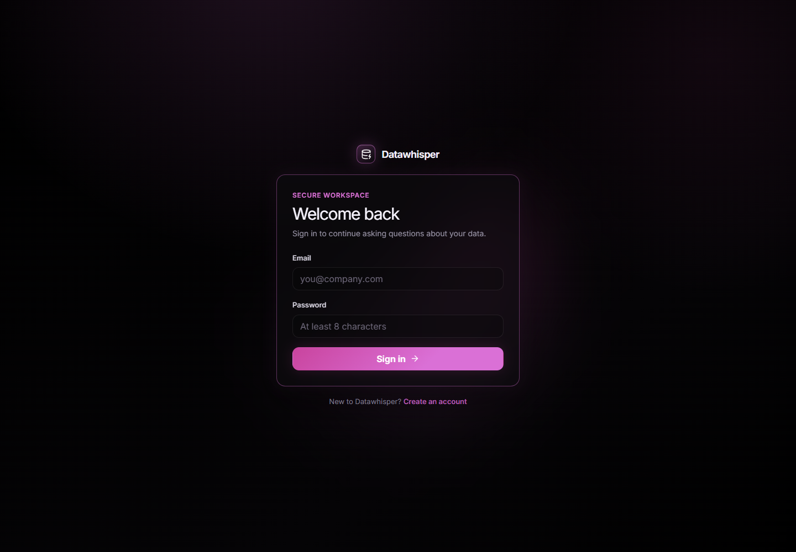
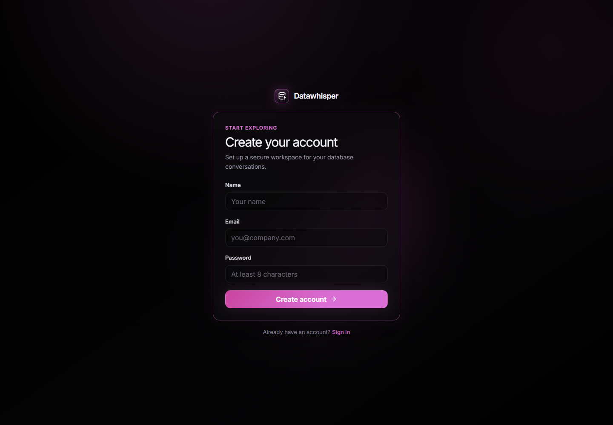
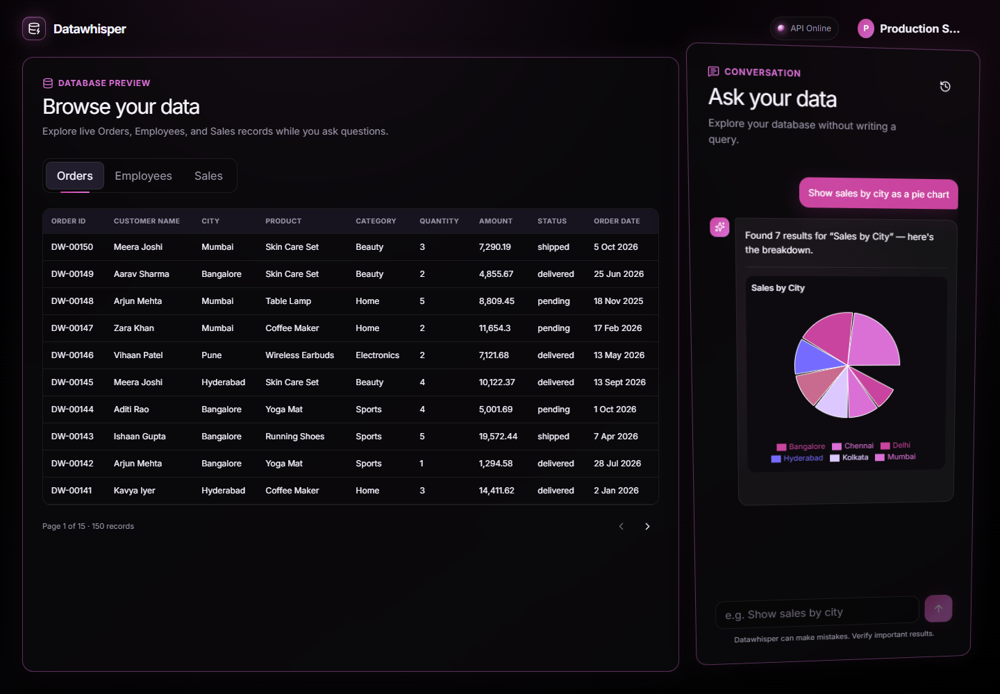
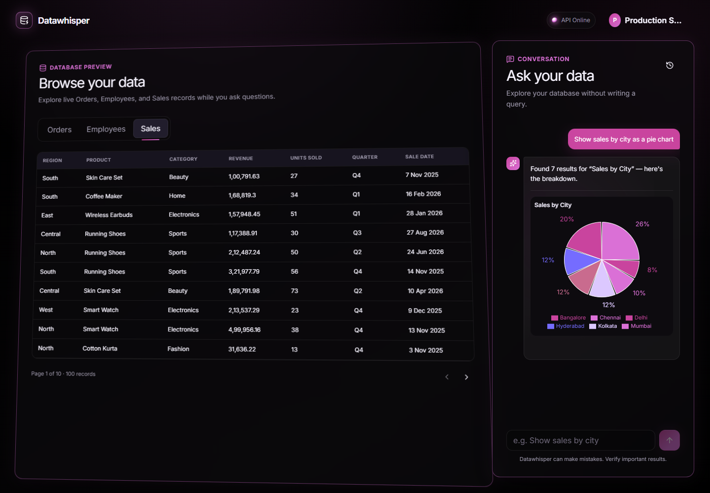
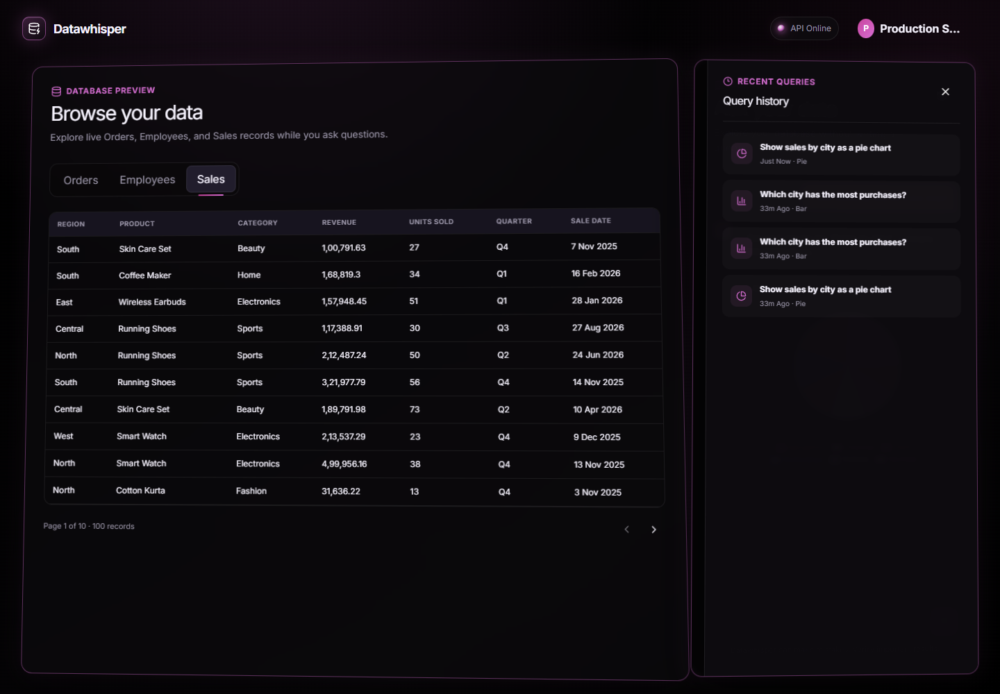
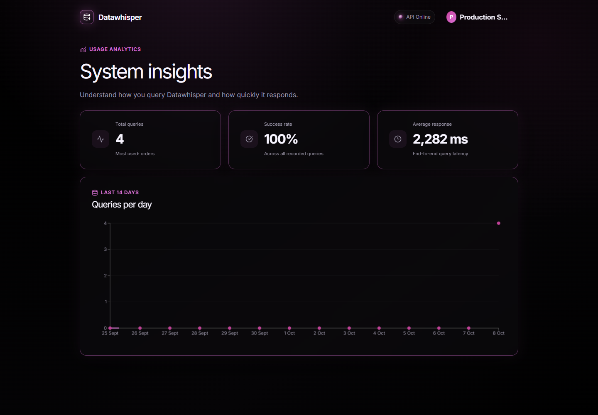
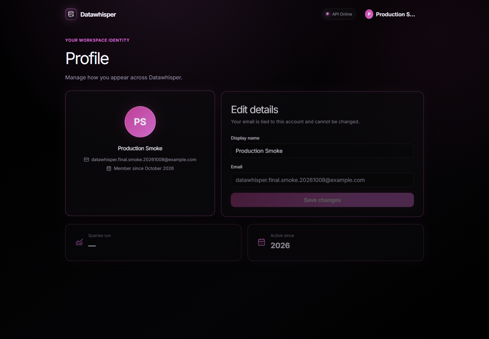
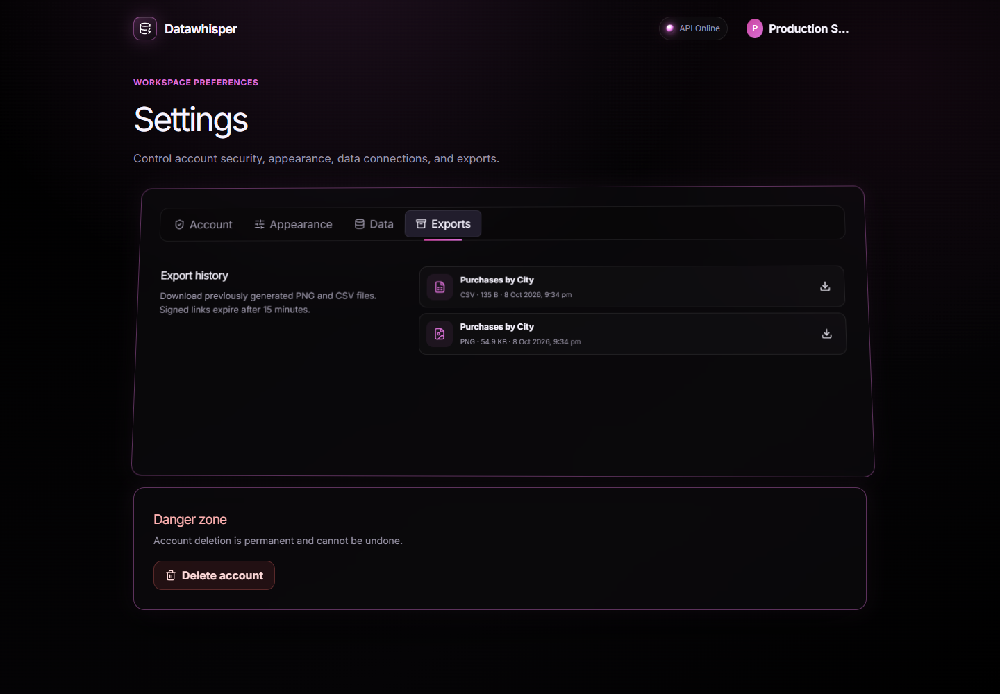
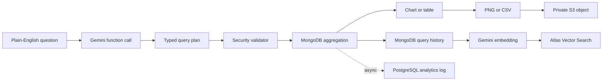

# Datawhisper

Ask operational data questions in plain English and turn safely executed database answers into useful charts.

## [Try the live demo →](https://datawhisper-three.vercel.app)

> The API runs on Render's free tier. Its first request after a period of inactivity can take 30–50 seconds while the service wakes up.

## The problem

Operational data is valuable, but the people who need an answer often cannot write database queries. Datawhisper lets them ask a question in everyday language, converts it into a constrained MongoDB aggregation, executes it through a security-focused validation layer, and presents the result immediately as a chart or table.

## Screenshots

### Authentication



Secure sign-in for an existing Datawhisper workspace.



Account creation with client- and server-side validation.

### Ask your data



A live natural-language question rendered as a sales-by-city pie chart alongside source records.



Paginated Sales data; Orders and Employees are available from the same dashboard.



User-scoped query history with chart types and one-click query reruns.

### Understand and manage the workspace



PostgreSQL-backed usage analytics with success rate, response time, and a 14-day trend.



Profile management with a simple initials-based identity avatar.



Account, appearance, connection, and S3 export-history settings with signed re-download links.

## Tech stack

### Frontend

- React 19 and Vite
- Tailwind CSS v4 and shadcn-style UI primitives
- Recharts for bar, pie, line, and table visualizations
- Framer Motion for responsive interaction and reduced-motion-aware animation
- Axios, React Router, and browser-side PNG/CSV generation

### Backend

- TypeScript in strict mode
- Node.js and Express 5
- Zod request and environment validation
- JWT authentication with bcrypt password hashing
- Helmet, CORS allowlisting, and API/query rate limiting

### AI/ML

- Google Gemini function calling for structured query plans
- `gemini-embedding-001` embeddings
- MongoDB Atlas Vector Search for retrieval-augmented similar-question suggestions

### Databases

- MongoDB Atlas and Mongoose for users, operational data, query history, embeddings, and export metadata
- PostgreSQL with Prisma for denormalized usage analytics

### Cloud and infrastructure

- AWS S3 for generated PNG/CSV artifacts
- 15-minute presigned S3 download URLs and a 90-day export lifecycle
- Docker multi-stage builds and Docker Compose
- Vercel frontend and Render backend

## Key features

- Ask questions about Orders, Employees, and Sales in plain English.
- Generate safe MongoDB aggregations through Gemini function calling.
- Render responses dynamically as bar, pie, line, or sortable table views.
- Browse real paginated collection data beside the conversation.
- Keep user-scoped query history and rerun a previous question in one click.
- Retrieve semantically similar past questions while typing using vector search.
- Track total queries, success rate, most-used collection, average latency, and daily volume in PostgreSQL.
- Download charts as PNG or data as CSV, store copies privately in S3, and re-download them through expiring signed URLs.
- Manage profile details, password, appearance intensity, data connections, and exports from authenticated pages.

## Architecture and query flow



Gemini never receives permission to run arbitrary database code. It returns a typed function-call payload containing a collection, aggregation pipeline, chart type, and title. The server validates that plan, executes it against an allowed Mongoose model, returns the data for visualization, and records history and analytics independently.

## Security by design

The aggregation executor is the main trust boundary between generated AI output and the database:

- **Collection allowlist:** only `orders`, `employees`, and `sales` are queryable.
- **Stage allowlist:** only `$match`, `$group`, `$sort`, `$project`, `$limit`, `$count`, `$unwind`, `$lookup`, `$addFields`, `$bucket`, and `$facet` are accepted.
- **Forbidden operators:** destructive output stages and server-side JavaScript operators—including `$out`, `$merge`, `$function`, `$accumulator`, `$where`, and `$currentOp`—are rejected recursively.
- **Nested-pipeline validation:** `$facet` and `$lookup` pipelines receive the same checks, with a maximum nesting depth.
- **Bounded work:** pipelines are limited to 50 stages, results are capped at 500 rows, disk use is disabled, and execution has a five-second timeout.
- **Tenant isolation:** history, analytics, vector retrieval, and exports are scoped to the authenticated user.
- **Private artifacts:** S3 access is limited to `GetObject`/`PutObject` under `exports/*`; the application has no bucket-list or delete permission.
- **Safe failures:** storage and analytics failures are logged without exposing stack traces or breaking unrelated query responses.

## Run locally

### Prerequisites

- Node.js 20+
- MongoDB Atlas database
- PostgreSQL database such as Neon or Supabase
- Google Gemini API key
- Private AWS S3 bucket

### Environment

Copy the examples and add your own values—never commit the resulting `.env` files:

```bash
cp server/.env.example server/.env
cp client/.env.example client/.env
```

The server requires:

```text
MONGODB_URI
DATABASE_URL
GEMINI_API_KEY
GEMINI_MODEL
GEMINI_EMBEDDING_MODEL
JWT_SECRET
AWS_ACCESS_KEY_ID
AWS_SECRET_ACCESS_KEY
AWS_REGION
AWS_S3_BUCKET_NAME
CLIENT_URL
```

Set `VITE_API_URL` in `client/.env` when the frontend should call a non-default API origin. Create the Atlas Vector Search index named `query_history_embedding` using the definition documented in `server/src/models/QueryHistory.ts`, and apply the Prisma migration once with `npm run prisma:migrate --prefix server`.

### Install and start

```bash
npm run install:all
npm run dev
```

Open `http://localhost:5173`; the API defaults to `http://localhost:5000`.

### Run with Docker Compose

After configuring `server/.env`:

```bash
docker compose up --build
```

Open `http://localhost:8080`. Compose builds both applications, serves the frontend through nginx, proxies `/api` to Express, and connects to the externally managed Atlas, PostgreSQL, Gemini, and S3 services.

Stop the stack with:

```bash
docker compose down
```

## Live links

- **Frontend:** https://datawhisper-three.vercel.app
- **Backend health:** https://datawhisper-api-live.onrender.com/api/health

The frontend is hosted on Vercel and the TypeScript API is hosted on Render. Render's free service sleeps after inactivity, so the first request during a demo may take approximately 30–50 seconds; subsequent requests are fast.
